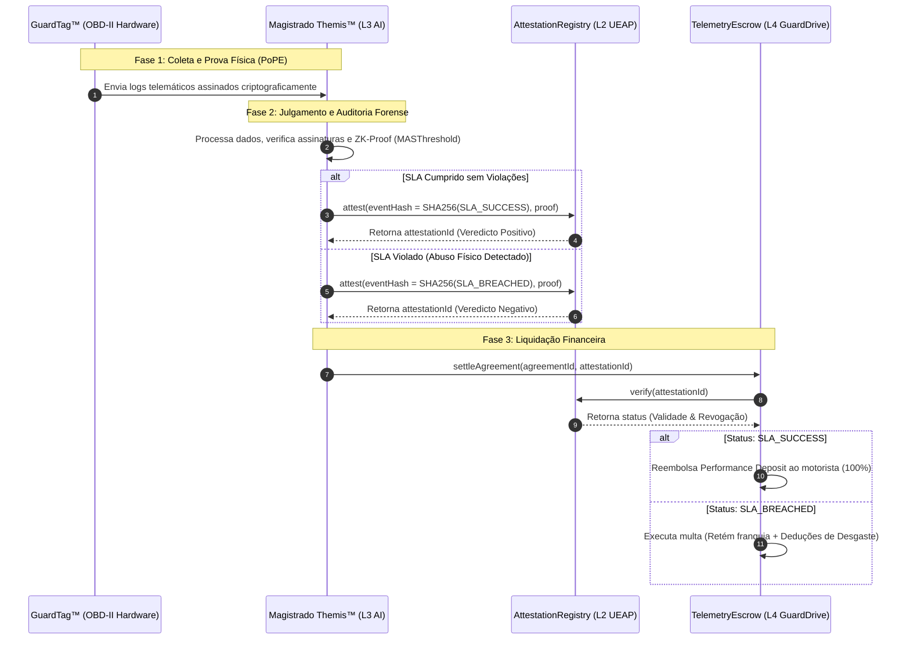

# Arquitetura de Integração: UEAP & Magistrado Themis™

Este documento formaliza e detalha a integração profunda entre o **Universal Event Attestation Protocol (UEAP)** e o **Magistrado Themis™** (o árbitro inteligente/forense do ecossistema GuardDrive™).

> [!IMPORTANT]
> **Divisão de Propriedade Intelectual (IP):**
> O **Universal Event Attestation Protocol (UEAP)** e o **Magistrado Themis™** são ativos proprietários de **Symbeon Labs (P&D Core)**. O **GuardDrive™** é a camada de produto comercial B2B (Go-to-Market) que licencia essa infraestrutura científica para habilitar a liquidação e conformidade forense de frotas.

---

## 🏛️ 1. O Papel das Duas Entidades

Para que uma disputa de telemetria automotiva tenha validade jurídica e liquidação automática de fundos on-chain, a arquitetura da Symbeon Labs separa a **infraestrutura de registro** da **lógica de julgamento**, integrada ao Escrow comercial do GuardDrive™:

```
+---------------------------------------------------------------------------------+
|                                 ORDEM DE CAMADAS                                |
|                                                                                 |
|  [L4 - Escrow Liquidation]  --> GuardDriveTelemetryEscrow.sol (Modelo de Taxas) |
|         ▲                                                                       |
|         | (Chama verify() on-chain)                                             |
|         ▼                                                                       |
|  [L2 - Protocol Registry]   --> UEAP: AttestationRegistry.sol (Registrador)     |
|         ▲                                                                       |
|         | (Emite veredicto assinado viaonlyRole(ISSUER_ROLE))                   |
|         ▼                                                                       |
|  [L3 - AI Forensic Oracle]  --> Magistrado Themis™ (LLM/Oracle Jurídico)       |
+---------------------------------------------------------------------------------+
```

### A. O Universal Event Attestation Protocol (UEAP)
* **O que faz:** É o registrador universal e agnóstico de evidências imutáveis on-chain. Ele não sabe as regras de condução de um carro específico, apenas sabe registrar se um evento ocorreu e se sua prova é válida.
* **Smart Contract:** `AttestationRegistry.sol` gerencia os hashes de eventos (`eventHash`), emissores autorizados (`ISSUER_ROLE`) e status de revogação de atestações.

### B. O Magistrado Themis™
* **O que faz:** É a inteligência forense e o árbitro de conformidade (AI Oracle). Ele avalia se houve infração contratual com base nos logs assinados pelo hardware e pelas provas matemáticas de conhecimento zero geradas na borda.
* **Soberania:** O Magistrado Themis™ detém a chave privada autorizada com `ISSUER_ROLE` no `AttestationRegistry` da UEAP. Quando um SLA é violado ou concluído com sucesso, o Themis assina e emite a atestação definitiva.

---

## 📡 2. O Fluxo de Integração e Ciclo de Vida do Evento

Abaixo está o ciclo de vida completo de ponta a ponta de um evento de mobilidade, do silício físico ao veredicto na blockchain.



---

## 💻 3. Código Solidity: Orquestração do Smart Contract

Para integrar o `TelemetryEscrow` com a `UEAP`, o contrato inteligente do GuardDrive™ consome a interface de registro de atestações da UEAP.

```solidity
// SPDX-License-Identifier: MIT
pragma solidity ^0.8.20;

interface IAttestationRegistry {
    struct Attestation {
        bytes32 eventHash;
        address issuer;
        bytes proof;
        uint256 timestamp;
        bool revoked;
    }
    
    function attest(bytes32 eventHash, bytes calldata proof) external returns (bytes32);
    function verify(bytes32 attestationId) external view returns (bool);
    function attestations(bytes32 attestationId) external view returns (
        bytes32 eventHash,
        address issuer,
        bytes memory proof,
        uint256 timestamp,
        bool revoked
    );
}

contract GuardDriveTelemetryEscrow {
    IAttestationRegistry public immutable ueapRegistry;
    address public immutable magistradoThemis;

    // Hashes predefinidos de eventos UEAP para o ecossistema GuardDrive
    bytes32 public constant EVENT_SLA_SUCCESS = keccak256("GUARDDRIVE.SLA.SUCCESS");
    bytes32 public constant EVENT_SLA_BREACHED = keccak256("GUARDDRIVE.SLA.BREACHED");

    struct Agreement {
        uint256 tokenId;
        uint256 depositAmount;
        bool settled;
    }

    mapping(bytes32 => Agreement) public agreements;

    constructor(address _ueapRegistry, address _magistradoThemis) {
        ueapRegistry = IAttestationRegistry(_ueapRegistry);
        magistradoThemis = _magistradoThemis;
    }

    function settleAgreement(bytes32 agreementId, bytes32 attestationId) external {
        Agreement storage agreement = agreements[agreementId];
        require(!agreement.settled, "Escrow already settled");

        // 1. Valida a atestação diretamente no contrato UEAP
        require(ueapRegistry.verify(attestationId), "UEAP: Invalid or revoked attestation");

        // 2. Recupera o veredicto registrado pelo Magistrado Themis
        (bytes32 eventHash, address issuer, , , ) = ueapRegistry.attestations(attestationId);
        require(issuer == magistradoThemis, "GuardDrive: Unauthorized arbiter");

        agreement.settled = true;

        if (eventHash == EVENT_SLA_SUCCESS) {
            // Reembolsa o motorista
        } else if (eventHash == EVENT_SLA_BREACHED) {
            // Aplica multas e transfere para a locadora
        } else {
            revert("GuardDrive: Unknown event verdict");
        }
    }
}
```

---

## 🛠️ 4. Guia do Desenvolvedor: Integração TypeScript (Membrane SDK)

Script executado pelo agente **Magistrado Themis™** para emitir um veredicto em lote sobre uma locação encerrada.

```typescript
import { MembraneSDK, Wallet } from '@symbeon/membrane-sdk';

const themisPrivateKey = process.env.THEMIS_PRIVATE_KEY;
const themisWallet = new Wallet(themisPrivateKey);

const sdk = new MembraneSDK({
    wallet: themisWallet,
    providerUrl: 'https://sepolia.infura.io/v3/your-project-id'
});

async function runThemisAudit(agreementId: string, telemetryData: any) {
    console.log(`[Magistrado Themis] Iniciando auditoria do acordo ${agreementId}...`);

    // 1. Rodar lógica forense local (Simulado / IA Analysis)
    const isCompliant = telemetryData.maxSpeed <= 120 && telemetryData.maxGForce <= 60;
    
    // 2. Determina o hash de evento UEAP
    const eventHash = isCompliant 
        ? sdk.utils.keccak256("GUARDDRIVE.SLA.SUCCESS")
        : sdk.utils.keccak256("GUARDDRIVE.SLA.BREACHED");

    // 3. Serializa a prova forense
    const proofBytes = sdk.utils.abiEncode(["uint256", "bool"], [telemetryData.timestamp, isCompliant]);

    console.log('[Magistrado Themis] Registrando atestação no UEAP...');

    // 4. Registra na UEAP
    const attestTx = await sdk.contracts.ueapRegistry.attest(eventHash, proofBytes);
    const attestReceipt = await attestTx.wait();
    const attestationId = attestReceipt.events['AttestationRegistered'].args.attestationId;

    console.log(`[Magistrado Themis] Atestação UEAP gerada: ${attestationId}`);
    console.log('[Magistrado Themis] Enviando liquidação ao Escrow...');

    // 5. Dispara a liquidação no Escrow
    const settleTx = await sdk.contracts.telemetryEscrow.settleAgreement(agreementId, attestationId);
    await settleTx.wait();

    console.log(`[Magistrado Themis] Escrow liquidado com base no veredicto.`);
}
```
