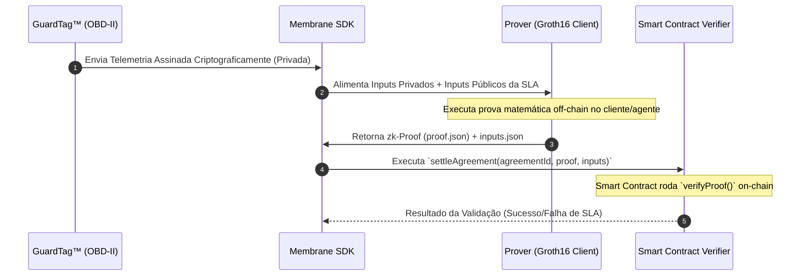

# Especificação Técnica: Circuitos ZK-SNARKs GuardDrive™

Este documento formaliza as especificações dos circuitos aritméticos de Conhecimento Zero (**ZK-SNARKs**) utilizados pelo ecossistema **GuardDrive™** para garantir conformidade de SLA telemático e privacidade de rota.

---

## 🔒 1. Privacidade por Abstração (Privacy-by-Abstraction)

Na telemetria veicular tradicional, seguradoras e locadoras coletam logs completos de GPS e velocidade. Isso viola a privacidade do usuário (LGPD/GDPR) e cria passivos regulatórios severos para as corporações.

O **ZK-Membrane** do GuardDrive™ resolve isso:
* **Entrada Privada (Segredo):** As coordenadas GPS exatas, velocidades instantâneas e carimbos de tempo brutos.
* **Entrada Pública:** Limites do SLA do contrato (ex: velocidade máxima autorizada, limites geográficos de operação).
* **Saída Pública (Proof):** Um sinal booleano ($1$ para Conformidade, $0$ para Violação) acompanhado da assinatura criptográfica do hardware.

---

## 🛠️ 2. Especificação do Circuito (`MASThreshold.circom`)

O circuito é implementado em **Circom** e compilado para gerar provadores e verificadores baseados no protocolo de pareamento **Groth16**.

### Inputs & Outputs do Circuito

```
           +---------------------------------------------+
           |             MASThreshold.circom             |
           |                                             |
           |   [Private Inputs]                          |
           |   --> speedArray[N]      (Velocidades)      |
           |   --> gForceArray[N]     (Força G)          |
           |   --> latitudeArray[N]   (GPS Lat)          |
           |   --> longitudeArray[N]  (GPS Long)         |
           |                                             |
           |   [Public Inputs]                           |
           |   --> maxAllowedSpeed    (SLA Limit)        |
           |   --> maxAllowedGForce   (SLA Limit)        |
           |   --> allowedGeoHash     (Geo-fence Limit)  |
           |                                             |
           |   [Public Outputs]                          |
           |   --> isValid            (1 = OK, 0 = FAIL) |
           |   --> dataCommitment     (SHA-256 Hash)     |
           +---------------------------------------------+
```

---

## 📐 3. Lógica Matemática do Circuito (Restrições Aritméticas)

Para cada medição $i$ no array de tamanho $N$, o circuito realiza as seguintes verificações matemáticas rígidas:

### A. Validação de Velocidade
O circuito calcula o sinal de violação para velocidade usando comparadores aritméticos integrados em R1CS (Rank-1 Constraint System):

$$\text{isSpeedViolated}[i] \leftarrow \text{GreaterThan}(\text{speedArray}[i], \text{maxAllowedSpeed})$$

### B. Validação de Força-G
Valida acelerações físicas longitudinais e laterais:

$$\text{isGForceViolated}[i] \leftarrow \text{GreaterThan}(\text{gForceArray}[i], \text{maxAllowedGForce})$$

### C. Geração do Compromisso de Dados (Data Commitment)
Para garantir que a prova ZK foi gerada a partir dos mesmos dados reais e imutáveis coletados na estrada, o circuito gera um hash SHA-256 das entradas privadas e expõe publicamente como `dataCommitment`. O Smart Contract on-chain valida que este compromisso corresponde ao hash assinado pelo **GuardTag™**:

$$\text{dataCommitment} \leftarrow \text{SHA256}(\text{speedArray}, \text{gForceArray}, \text{latitudeArray}, \text{longitudeArray})$$

---

## 🛡️ 4. Fluxo de Geração e Verificação de Provas


